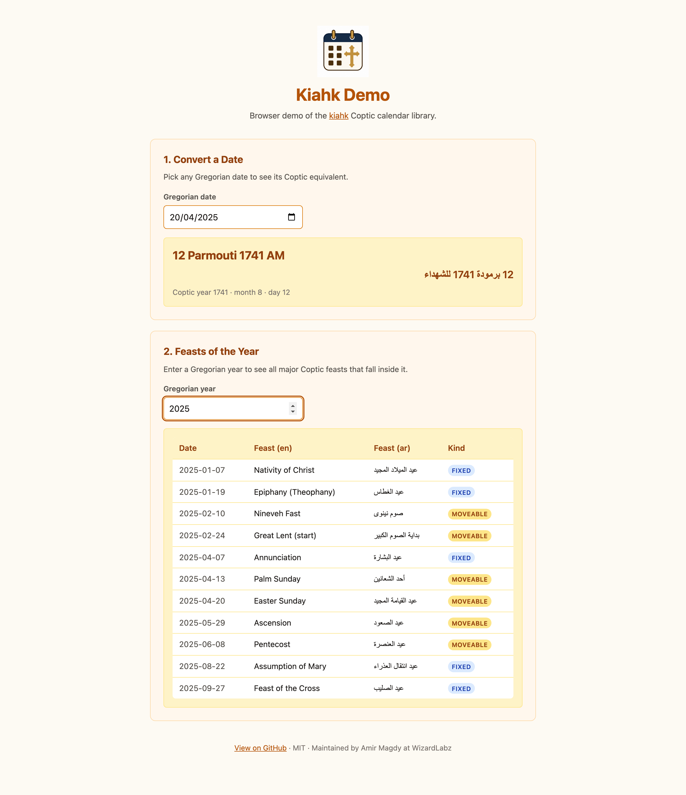

  

# Kiahk

Coptic calendar arithmetic — date conversion, Easter, and feast days. Ported to multiple languages from a single canonical spec in `core/`.

## Package versions

## Build status

## Ports & distributions

Same algorithms, same `core/test-vectors.json` contract, distributed through each language's native package manager. Every port version is kept in lockstep — the version badges below should all read the same number.

| Language | Source | Package | Install |
| --- | --- | --- | --- |
| TypeScript / JavaScript | [`js/`](js/) |  | `npm install kiahk` |
| Python | [`py/`](py/) |  | `pip install kiahk` |
| Go | [`go/`](go/) |  | `go get github.com/amir-magdy-of-wizardlabz/kiahk/go` |
| Dart / Flutter | [`dart/`](dart/) |  | `dart pub add kiahk` |
| Swift (SwiftPM) | [`swift/`](swift/) |  | add `https://github.com/amir-magdy-of-wizardlabz/kiahk.git` to `Package.swift` |
| Swift (CocoaPods) | [`swift/`](swift/) |  | `pod 'Kiahk'` in `Podfile` |
| C# / .NET | [`csharp/`](csharp/) |  | `dotnet add package Kiahk` |
| C | [`c/`](c/) |  | download tarball or `add_subdirectory(c)` in CMake |

See each port's README for full install + quick-start examples, and for English + Arabic month-name rendering.

## Canonical spec

- `core/algorithms.md` — pseudocode for Gregorian↔Coptic, Easter, feasts
- `core/feasts.json` — fixed + moveable feast registry
- `core/test-vectors.json` — cross-port test contract

Every port must produce identical results against `core/test-vectors.json`.

## Demo

**Try it live → <https://raw.githack.com/amir-magdy-of-wizardlabz/kiahk/master/demo/index.html>**

  

A small browser demo of the JS port lives in [`demo/`](demo/). It lets you:

- Pick a Gregorian date and see its Coptic equivalent (English + Arabic month names)
- Enter a Gregorian year and view every major Coptic feast (en + ar names, fixed vs moveable)

Source: [`demo/index.html`](demo/index.html), [`demo/app.js`](demo/app.js). See [`demo/README.md`](demo/README.md) for how to run it locally.

> The hosted demo is served via [raw.githack.com](https://raw.githack.com), a free proxy that serves GitHub files with correct MIME types. It reads `master` directly, so the link tracks whatever's on `master` at any given moment.

## License

Licensed under the [MIT License](LICENSE).

Maintained by Amir Magdy at WizardLabz.
